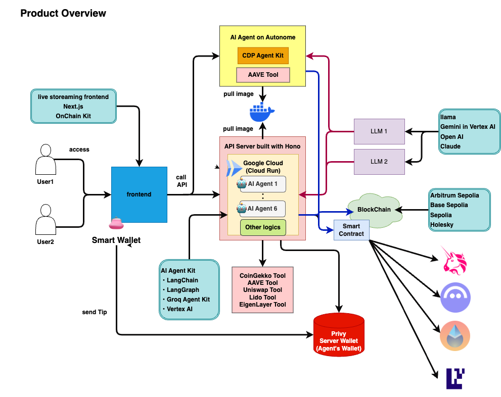

# GoogleAIAgentHackathon2024

GoogleAIAgentHackathon用リポジトリです。


---

## Live Demo

- Vercel

    [https://google-ai-agent-hackathon2024.vercel.app/](https://google-ai-agent-hackathon2024.vercel.app/)

## プロジェクト構成

```bash
.
├── README.md
├── biome.json
├── docs
│   └── overview.drawio
├── package.json
├── pkgs
│   ├── api              APIサーバー用のディレクトリ
│   ├── cdktf            CDK for Terraform用のディレクトリ
│   ├── contract         スマートコントラクト用のディレクトリ
│   └── frontend         フロントエンド用のディレクトリ
├── pnpm-lock.yaml
└── pnpm-workspace.yaml
```

## アーキテクチャ図



## シーケンス図


## セットアップ

- ### **CLI系**

    - pnpmをインストールすること
    - gcloud CLIをインストールすること
    - Terraform CLIをインストールすること
    - CDKTF CLIをインストールすること
    - docker CLIをインストールすること

- ### **環境変数系**

    動かすためにはそれぞれ以下の通り環境変数をセットアップする必要があります。

    - API

        ```txt
        PROJECT_ID=""
        REGION=""
        OPENAI_API_KEY=""
        TAVILY_API_KEY=""
        CDP_API_KEY_NAME=
        CDP_API_KEY_PRIVATE_KEY=
        NETWORK_ID="base-sepolia"
        ALCHEMY_API_KEY=""
        Groq_API_Key=""
        COINGECKO_API_KEY=""
        PRIVY_APP_ID=""
        PRIVY_APP_SECRET_KEY=""
        ANTHROPIC_KEY_API=
        ```

    - CDK for Terraform

        ```txt
        PROJECT_ID=""
        REGION=""
        OPENAI_API_KEY=""
        TAVILY_API_KEY=""
        CDP_API_KEY_NAME=
        CDP_API_KEY_PRIVATE_KEY=
        NETWORK_ID="base-sepolia"
        ALCHEMY_API_KEY=""
        Groq_API_Key=""
        COINGECKO_API_KEY=""
        PRIVY_APP_ID=""
        PRIVY_APP_SECRET_KEY=""
        ANTHROPIC_KEY_API=
        ```

    - スマートコントラクト

        ```txt
        PRIVATE_KEY=""
        ARBITRUM_ETHERSCAN_KEY=""
        BASESCAN_API_KEY=""
        ```

    - フロントエンド

        ```txt
        NEXT_PUBLIC_ONCHAINKIT_API_KEY=
        ```

## 動かし方

- ### 共通

    - インストール

        ```bash
        pnpm install
        ```

    - formatter & liter 適用

        ```bash
        pnpm run biome:check
        ```

    - スマートコントラクト側にformatter & liter 適用

        ```bash
        pnpm contract format
        ```

- ### API

    - ローカルでの起動方法

        ```bash
        pnpm api dev
        ```

    - dockerイメージのビルド

        ```bash
        pnpm api run container:build
        ```

        以下でDocker イメージを確認

        ```bash
        docker image ls
        ```

    - dockerイメージを使ってコンテナを起動させる

        ```bash
        pnpm api run container:run hono-vertexai-image:latest
        ```

    - docker イメージを格納するためのリポジトリをGoogle Cloud側に作成する。

        ※ あらかじめ gcloudの認証は済ませておくこと！

        ```bash
        gcloud artifacts repositories create <コンテナリポジトリ名> --repository-format docker --location <リージョン名>
        ```

    - docker イメージのプッシュ

        `api` フォルダ配下で動かしてください。

        ※ あらかじめ gcloudの認証は済ませておくこと！

        ```bash
        gcloud builds submit --tag <リージョン名>-docker.pkg.dev/<プロジェクトID>/<コンテナリポジトリ名>/<コンテナイメージ名>
        ```

- ### CDK for Terraform

    ※ あらかじめ gcloudの認証は済ませておくこと！

    - デプロイ

        ```bash
        pnpm cdktf run deploy 'hono-vertexai-sample-api'
        ```

    - 削除

        ```bash
        pnpm cdktf run destroy 'hono-vertexai-sample-api'
        ```

- ### スマートコントラクト

    - コンパイル

        ```bash
        pnpm contract compile
        ```

    - テスト

        ```bash
        pnpm contract test
        ```

    - デプロイ

        ```bash
        pnpm contract deploy:Lock --network <ネットワーク名>
        ```

        デプロイできる ネットワーク名は `hardhat.config.ts`を参照してください。

    - verify

        ```bash
        pnpm contract verify chain-<チェーンID>
        ```

    - get getChainInfo

        ```bash
        pnpm contract getChainInfo --network <ネットワーク名>
        ```

    - get Balance

        ```bash
        pnpm contract getBalance --network <ネットワーク名>
        ```

- ### フロントエンド

    - ビルド

        ```bash
        pnpm frontend build
        ```


    - ローカルで起動

        ```bash
        pnpm frontend dev
        ```
