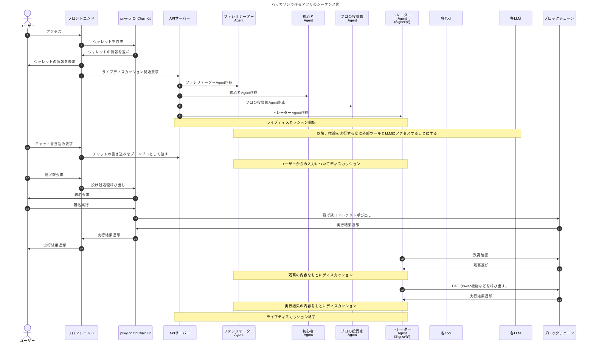

# シーケンス図用のメモ

```mermaid
sequenceDiagram
    title: ハッカソンで作るアプリのシーケンス図
    autonumber
    actor user as ユーザー
    participant frontend as フロントエンド
    participant userWallet as privy or OnChainKit
    participant api as APIサーバー
    participant agent1 as ファシリテーター<br/>Agent
    participant agent2 as 初心者<br/>Agent
    participant agent3 as プロの投資家<br/>Agent
    participant agent4 as トレーダー<br/>Agent<br/>(Signer役)
    participant tools as 各Tool
    participant llm as 各LLM
    participant blockchain as ブロックチェーン
    user ->> frontend: アクセス
    frontend ->> userWallet: ウォレットを作成
    userWallet ->> frontend: ウォレットの情報を返却
    frontend ->> user: ウォレットの情報を表示
    frontend ->> api: ライブディスカッション開始要求
    api ->> agent1: ファシリテーターAgent作成
    api ->> agent2: 初心者Agent作成
    api ->> agent3: プロの投資家Agent作成
    api ->> agent4: トレーダーAgent作成
    note over api, agent4: ライブディスカッション開始
    note over agent1, llm: 以降、推論を実行する度に外部ツールとLLMにアクセスすることにする
    user ->> frontend: チャット書き込み要求
    frontend ->> api: チャットの書き込みをプロンプトとして渡す
    note over agent1, agent4: ユーザーからの入力についてディスカッション
    user ->> frontend: 投げ銭要求
    frontend ->> userWallet: 投げ銭処理呼び出し
    userWallet ->> user: 署名要求
    user ->> userWallet: 署名実行
    userWallet ->> blockchain: 投げ銭コントラクト呼び出し
    blockchain ->> userWallet: 実行結果返却
    userWallet ->> frontend: 実行結果返却
    frontend ->> user: 実行結果返却
    agent4 ->> blockchain: 残高確認
    blockchain ->> agent4: 残高返却
    note over agent1, agent4: 残高の内容をもとにディスカッション
    agent4 ->> blockchain: DeFiのswap機能などを呼び出す。
    blockchain ->> agent4: 実行結果返却
    note over agent1, agent4: 実行結果の内容をもとにディスカッション
    note over api, agent4: ライブディスカッション終了
```
