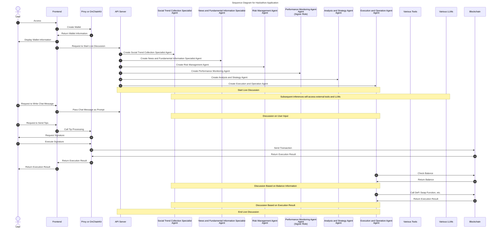

# Sequence

```mermaid
sequenceDiagram
    title: Sequence Diagram for Hackathon Application
    autonumber
    actor user as User
    participant frontend as Frontend
    participant userWallet as Privy or OnChainKit
    participant api as API Server
    participant agent1 as Social Trend Collection Specialist<br/>Agent
    participant agent2 as News and Fundamental Information Specialist<br/>Agent
    participant agent3 as Risk Management Agent<br/>Agent
    participant agent4 as Performance Monitoring Agent<br/>Agent<br/>(Signer Role)
    participant agent5 as Analysis and Strategy Agent<br/>Agent
    participant agent6 as Execution and Operation Agent<br/>Agent
    participant tools as Various Tools
    participant llm as Various LLMs
    participant blockchain as Blockchain
    user ->> frontend: Access
    frontend ->> userWallet: Create Wallet
    userWallet ->> frontend: Return Wallet Information
    frontend ->> user: Display Wallet Information
    frontend ->> api: Request to Start Live Discussion
    api ->> agent1: Create Social Trend Collection Specialist Agent
    api ->> agent2: Create News and Fundamental Information Specialist Agent
    api ->> agent3: Create Risk Management Agent
    api ->> agent4: Create Performance Monitoring Agent
    api ->> agent5: Create Analysis and Strategy Agent
    api ->> agent6: Create Execution and Operation Agent
    note over api, agent6: Start Live Discussion
    note over agent1, llm: Subsequent inferences will access external tools and LLMs
    user ->> frontend: Request to Write Chat Message
    frontend ->> api: Pass Chat Message as Prompt
    note over agent1, agent6: Discussion on User Input
    user ->> frontend: Request to Send Tips
    frontend ->> userWallet: Call Tip Processing
    userWallet ->> user: Request Signature
    user ->> userWallet: Execute Signature
    userWallet ->> blockchain: Send Transaction
    blockchain ->> userWallet: Return Execution Result
    userWallet ->> frontend: Return Execution Result
    frontend ->> user: Return Execution Result
    agent6 ->> blockchain: Check Balance
    blockchain ->> agent6: Return Balance
    note over agent1, agent6: Discussion Based on Balance Information
    agent6 ->> blockchain: Call DeFi Swap Function, etc.
    blockchain ->> agent6: Return Execution Result
    note over agent1, agent6: Discussion Based on Execution Result
    note over api, agent6: End Live Discussion
```
